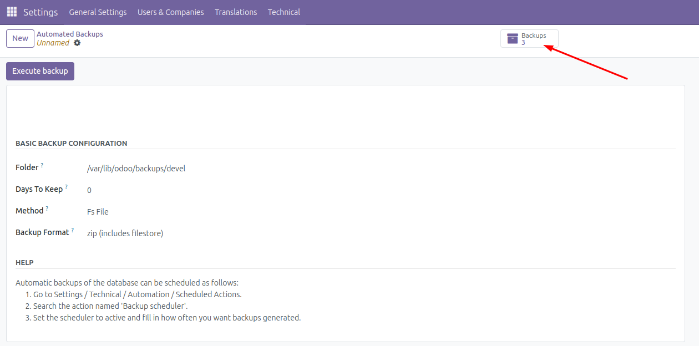
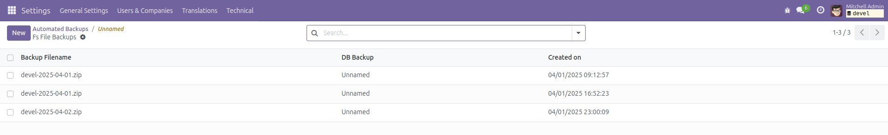

This module extends the functionality of the database backup system in Odoo by introducing a new backup method: **Fs File**. This method allows storing database backups as files using an FSSPEC implementation.

## How to Use the Module

### 1. Configure the Backup Method
1. Navigate to **Settings** > **Technical** > **Database Structure** > **Automated Backups**.
2. Create or edit a backup configuration.
3. In the **Backup Method** field, select **Fs File**.
4. Configure other fields as needed, such as the backup format and retention settings.
5. Save the configuration.

### 2. Perform a Backup
1. From the list of backup configurations, select the one configured with the **Fs File** method.
2. Click the **Backup Now** button to initiate the backup process.
3. The backup will be stored as a file in the configured FSSPEC storage.

### 3. View Fs File Backups
1. Open the backup configuration form view.
2. In the top-right corner, you will see a **Backups** stat button (if backups exist).
3. Click the **Backups** button to view the list of Fs File backups associated with the configuration.

### 4. Manage Fs File Backups
- In the Fs File backups list view, you can see details such as the backup filename and associated database backup configuration.
- Use this view to manage or download backups as needed.

### Screenshots
- **Backup Configuration Form View**
  

- **Fs File Backups List View**
  

### Notes
- Ensure that the FSSPEC storage is properly configured before using the **Fs File** method.
- This module adds a new stat button in the backup configuration form view to quickly access Fs File backups.

